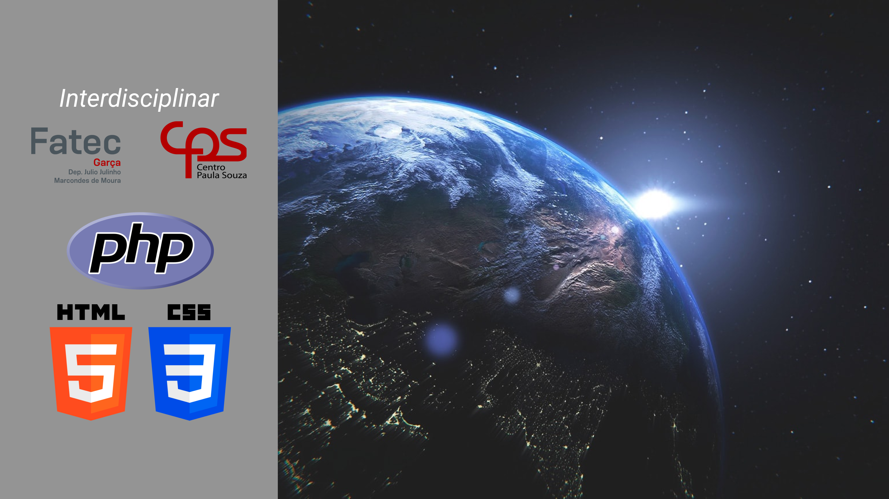

<h1 align="center">ERP Solar - Terra</h1>

Módulo representado pelo planeta Terra, a tela desenvolvida tem a função de fazer uma requisição ao banco de dados e receber um relatório/gráfico referente a solicitação.

    <a href='#-tecnologias'>Tecnologia</a> 
        <!-- &nbsp; &nbsp; &nbsp; | &nbsp; &nbsp; &nbsp;
    <a href='#-projeto'>Projeto</a>  -->
        &nbsp; &nbsp; &nbsp; | &nbsp; &nbsp; &nbsp;
    <a href='#-layout'>Layout</a> 

 

    

 

## 🚀 Tecnologias

Projeto foi desenvolvido utilizando as seguintes tecnologias:

- HTML e CSS
- PHP
- Banco de Dados: <i>MySQL - phpmyadmin</i>
- Figma

<!-- ## 🖥️ Projeto -->

## 📋 Layout

Você pode visualisar o layout do projeto através [DESSE LINK](<https://www.figma.com/file/Ct8mp0vrOpoIrXdP77tgyF/Tela-visualiza%C3%A7%C3%A3o-de-relat%C3%B3rio-(IHC)?type=design&node-id=36%3A33&t=xylP64twc56hKqoP-1>).  É necessário ter uma conta no [Figma](https://www.figma.com/) para acessá-lo.
